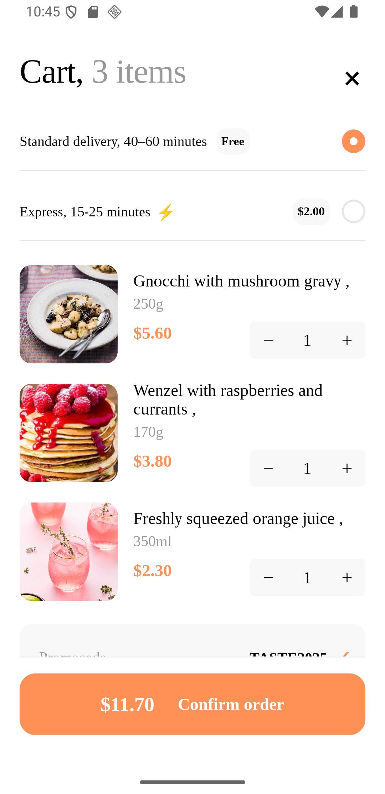

for install and run, clone repo, npm install and npx react-native run-android (with usb or emulator android)  

the screen was recreated as close as possible, was based on this first screen, the project has make with react native (android)   

https://dribbble.com/shots/25869703-Food-Delivery-Mobile-App-UI-UX-Design   

 

there is also a video "v.mp4" in the root folder, just download and check
